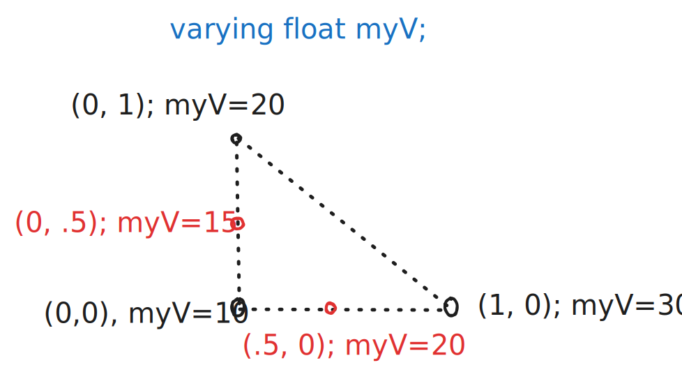

I've been learning shaders this week, and I wanted to share my impressions as a
beginner -- you might find it useful too.

A shader is a program that can transform data from an input object, like the
coordinates of its vertices, to a rasterized image that can be displayed on the
screen. It is one of the components that makes the graphics pipeline that allows
you to see stuff on your computer screen.

## The GLSL programming language

Shaders are written in a language which is very similar to C, and are compiled
by the GPU libraries. It includes built-in types to do linear algebra, like
vector and matrices, as well as functions that are useful in the context of
graphics, like
[`smoothstep`](https://registry.khronos.org/OpenGL-Refpages/gl4/html/smoothstep.xhtml).

```glsl
varying vec2 vUv;
uniform float uTime;

void main() {
	float value = 0.0;
	value += sin(uTime / 100. + vUv.x*100.);
	value += 5.*sin(uTime / 1000. + vUv.y*300.);
	gl_FragColor = vec4(value, value, value, 1.);
}
```

When writing a shader, the inputs and outputs are defined in the **global scope**.
The shader compiler checks if the global are available or not. In the previous
example, `vUv` and `uTime` are inputs to the shader, and it sets the
`gl_FragColor` "global". Each shader runs the `void main()` function, but you
can write your own functions like in C.

## Vertex and fragment shaders

There are two different types of shaders that will be run by our graphics
library:

- **Vertex shaders** maps the coordinates of our object's geometry, depending on
  the camera, perspective, or any other transformation.
- **Fragment shaders** calculate the color of each pixel in the triangle of the
  geometry.


First, we start with some 3d model described by triangles and its vertices. The
vertex shader first maps each vertex, to a location on the projection. The
simplest vertex shader for the library I'm using would look like this:

```glsl
// main.vert
void main() {
	gl_Position = projectionMatrix * modelViewMatrix * vec4(position, 1.0);
}
```

With the vertex shader, we can affect the 3d model we are working with. For
example, to apply some "ripple" effect to the surface of our object. Note that
the **vertex shader is run for each vertex**.

The fragment shader is more interesting though. After placing or vertices with
the vertex shader, our graphics library fills each triangle with pixels, and
**runs the fragment shader for each pixel**. This is an easy task to do with a
GPU, that can do many operations in parallel.

For example, we can write a shader that sets any pixel to red:

```glsl
// main.frag
void main() {
    gl_FragColor = vec4(1.0, 0.0, 0.0, 0.0);
}
```

This is not very interesting though, but in the next section we will do fancier
stuff with `varying`.

## Varying variables

What if we could set the color of a pixel, depending on its coordinates?
Fragment shaders don't have access to the location of our pixel -- at least not
in the library I'm using -- but the tool of GLSL to use here is `varying`. A
`varying` variable can be set from a vertex shader, and read from a fragment
shader. We can adjust our previous example like so:

```glsl
// main.vert
varying vec4 vPosition; 
void main() {
  vPosition = position;
	gl_Position = projectionMatrix * modelViewMatrix * vec4(position, 1.0);
}

// main.frag
varying vec4 vPosition;
void main() {
  gl_FragColor = vec4(vPosition.x, vPosition.y, 0.0, 1.0);
}
```


As you can see, we are coloring each pixel in our cube, depending on its
location -- greener areas come from a greater `y` coordinate and the red comes
from a greater `x`.

There is one detail though, which I think is pretty neat: our `vPosition` is
being set by the vertex shader. The vertex shader is only run for the 8 vertices
of the cube. How do we get all the in-between values for each pixel that the
fragment shader processes? That's what `varying` does: it interpolates the
value of the varying, depending on the 3 vertices of the triangle that we are
drawing:



In the previous diagram, only the 3 vertices of the triangle set the value of
the `varying float myV`. For any other point in the triangle, the value of `myV`
is interpolated depending on the value at the 3 vertices. I think this is very
neat.


## Keep learning!

That's all for now. I don't want to make a very long post, as I am still
learning how GLSL works. We could also talk how you can pass external variables
to the shader with the `uniform` qualifier, or how you can use UV's to map a 2D
texture into a 3D model, but that's for another day.

If you want to start writing shaders, I recommend the following tutorials:

- [Three.js Shaders (GLSL) Crash Course For Absolute Beginners](https://www.youtube.com/watch?v=oKbCaj1J6EI)
- [Introduction to shaders: Learn the basics!](https://www.youtube.com/watch?v=3mfvZ-mdtZQ)

You can actually render shaders on your browser thanks to WebGL, and these pages
give you a nice editor, for you to fiddle around:

- [Shadertoy](https://www.shadertoy.com/)
- [Shdr Editor](https://shdr.bkcore.com/)
